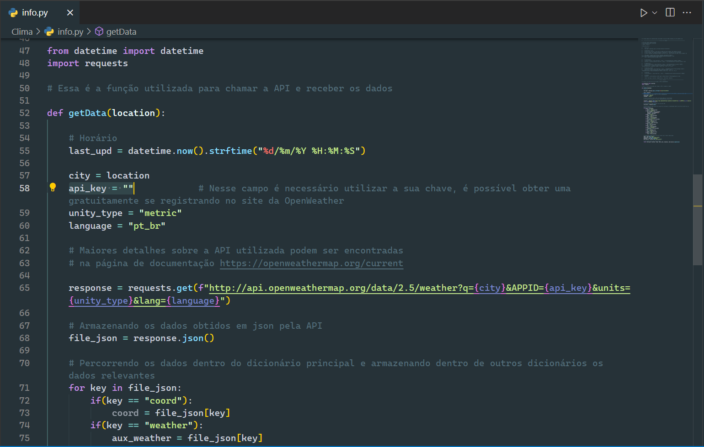
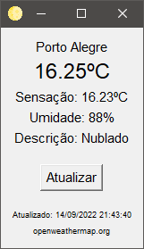
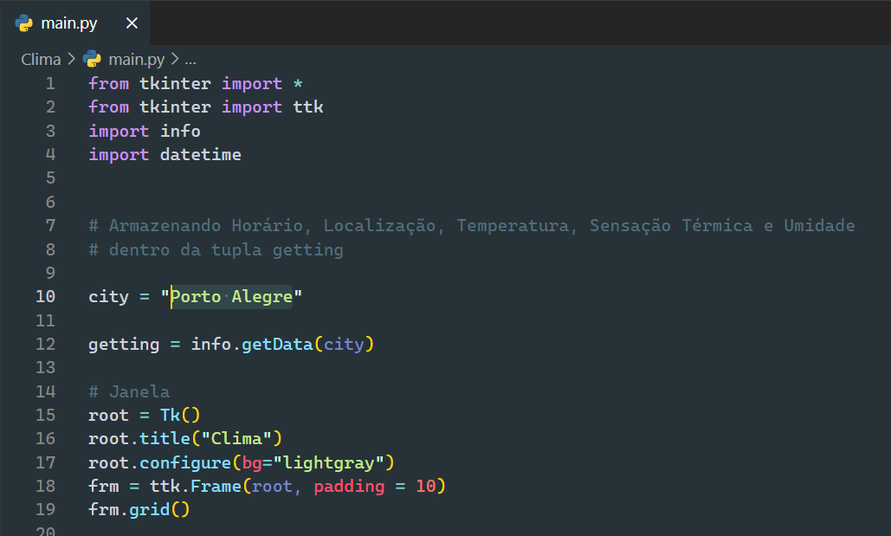

# Clima ☀🌙

  
  

## 🎯 Propósito

O objetivo desse projeto foi desenvolver um aplicação capaz de obter dados climáticos em tempo real, toda vez que o usuário desejar.

## 🧠 Experiência/Motivação

Conheci a API da [OpenWeather]("https://openweathermap.org/" "OpenWeather") por meio de um curso de JavaScript. Em meio a dias quentes de verão... e pensando em como cruzar o que havia aprendido em JS e o Python, me desafiei a criar uma aplicação de desktop que utilizasse o módulo [Tkinter]("https://docs.python.org/3/library/tkinter.html" "Link para documentação do módulo Python Tkinter") para exibir a temperatura da região onde moro.

### Status

O projeto está concluído. _Até o momento..._

## ✍ Como começar

Antes de começar de fato,  garanta que os módulos `requests` e `tkinter` estão instalados na sua máquina. Além disso é preciso abrir o arquivo `info.py` e informar uma credencial válida para utilizar a API da [OpenWeather]("https://openweathermap.org/" "OpenWeather"). É possível gerar uma chave, ao realizar cadastro no site da companhia, sendo que há um plano gratuito com limite de chamadas à API.

     

Após informar a sua chave, basta executar o arquivo `main.py`. Se tudo correr conforme esperado, a seguinte janela abaixo será exibida:

     

O projeto ainda conta com o botão atualizar, para buscar os dados recentes.

Lembre-se que a região exibida pode ser alterada. Para isso vá até o arquivo `main.py` e altere o valor da variável `city`:

     

